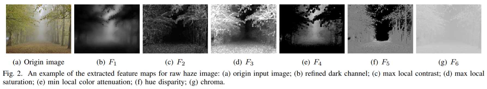

# ImgSensingNet: UAV Vision Guided Aerial-Ground Air Quality Sensing System

This repository contains part of the implementation code for paper [ImgSensingNet: UAV Vision Guided Aerial-Ground Air Quality Sensing System](http://www.mit.edu/~yuzhe/) (INFOCOM 2019).

__ImgSensingNet__ is a vision guided aerial-ground sensing system, for fine-grained air quality monitoring and forecasting using the fusion of haze images taken by the unmanned-aerial-vehicle (UAV) and the AQI data collected by an on-ground wireless sensor network (WSN).
This code contains the __vision part__ implementation of ImgSensingNet, where we realize the end-to-end inference from the taken hazy images to the corresponding AQI values. Specifically, we propose:
1. Six __content-nonspecific haze-relevant__ features for raw haze images, which extract the haze components from origin images while eliminating the influence of image content;
2. A __3D CNN model__ for end-to-end learning for AQI estimation of haze images based on the extracted haze components.

## Dependencies
The code was tested on
```
python == 3.6.5
opencv == 3.4.1
scipy == 0.19.1
```

## Haze-relevant Content-nonspecific Features

We propose a list of haze-relevant statistical features. An example of the extracted features is shown above.

### Refined Dark Channel
The [dark channel](https://ieeexplore.ieee.org/abstract/document/5567108) is an informative feature for haze detection, defined as the minimum of all pixel colors in a local patch.
To obtain a better estimation of haze density, we propose the _refined dark channel_ by applying the [guided filter](https://ieeexplore.ieee.org/abstract/document/6319316) on the estimated medium transmission, to capture the sharp edge discontinuous and outline the haze profile. ([`dark_channel.py`](dark_channel.py))

### Maximum Local Contrast
The contrast of the haze image can be highly reduced when haze exists. We therefore propose _max local contrast_ feature as the local maximum of local contrast values in a local patch. ([`max_local_contrast.py`](max_local_contrast.py))

### Maximum Local Saturation
Image saturation varies sharply with the change of haze in the scene. We therefore define _max local saturation_ feature that represents the maximum saturation value of pixels within a local patch. ([`max_local_saturation.py`](max_local_saturation.py))

### Minimum Local Color Attenuation
The scene depth is found to be positively correlated with the difference between the image brightness and the image saturation, which is regarded as the [color attenuation prior](https://ieeexplore.ieee.org/document/7128396). To process the raw depth map for better representation of the haze influence, we define the _min local color attenuation_ feature by considering the minimum pixel-wise depth within a local patch. ([`min_local_clr_attenuation.py`](min_local_clr_attenuation.py))

### Hue Disparity
The _hue disparity_ between the original image and its semi-inverse image (defined as the max value between original image and its inverse) can serve as another haze-relevant feature. ([`hue_disparity.py`](hue_disparity.py))

### Chroma
In the CIELab color space, the _chroma_ is one of the most representative image feature to describe the color degradation by the haze in the atmosphere, which we utilize as another feature. ([`chroma.py`](chroma.py))


## Data Generation
- [`feature_extract.py`](preprocess/feature_extract.py): Generate the six proposed feature images (grayscale, resized to 128\*128 pixels) corresponding to a set of input haze images. Run with
```bash
python feature_extract.py --data-path <path> --save-path <path>
```

- [`video_sampling.py`](preprocess/video_sampling.py): Generate haze images with a constant sampling rate when the source file is video (which is more efficient for data collection). Run with
```bash
python video_sampling.py --data-path <path> --save-path <path>
```

Note that the extracted feature maps of each image will first be stacked together as an input tensor (which we call as the “hardwired” layer), and then feed into a 3D CNN model for training. More details can be found in [our paper]().

## Demonstration
A real-time demo of the UAV vision-based sensing (including feature extraction and real-time prediction) can be found [here](https://www.youtube.com/watch?v=VUn4e-oP0xk).

## Citation
If you find the idea or code useful for your research, please cite our [paper](http://www.mit.edu/~yuzhe/):
```
@inproceedings{yang2019imgsensingnet,
  title={ImgSensingNet: UAV Vision Guided Aerial-Ground Air Quality Sensing System},
  author={Yang, Yuzhe and Hu, Zhiwen and Bian, Kaigui and Song, Lingyang},
  booktitle={Proceedings of the IEEE International Conference on Computer Communications (INFOCOM)},
  pages={1--9},
  year={2019},
  organization={IEEE}
}
```
